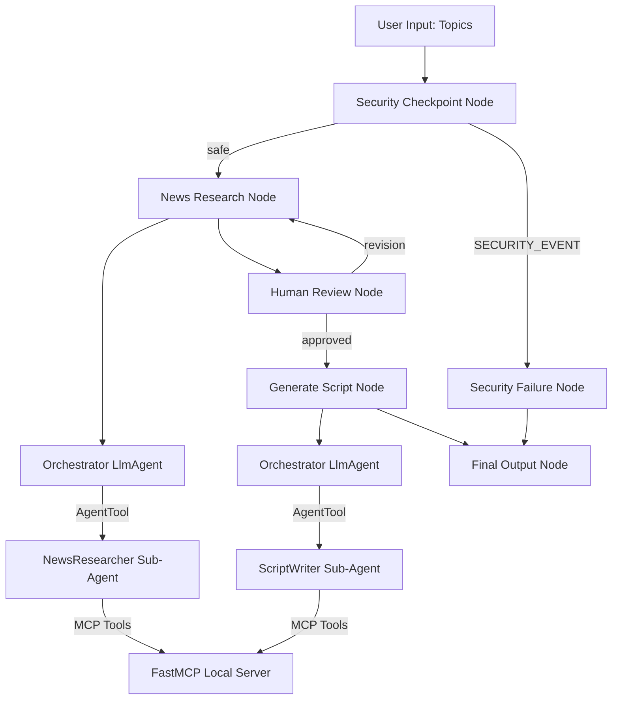

# Submission Write-Up: Podcast Script Curator

## 1. Problem Statement
Creating high-quality, engaging podcast episodes on technology news requires significant preparation time. Hosts must browse multiple news outlets, select interesting stories, summarize key details, and write a conversational dialogue script. For amateur and professional creators alike, this manual pipeline takes hours of research and writing before recording even begins. 

The **Podcast Script Curator** automates this workflow, acting as an autonomous producer that gathers fresh articles, summarizes them, requests host sign-off, and formats conversational scripts.

---

## 2. Solution Architecture

The application is structured as a deterministic graph-based state workflow using the ADK 2.0 graph engine:

---

## 3. Concepts Used & File References

- **ADK Workflow Graph:** Implemented in [agent.py](app/agent.py#L318-L333) using the `Workflow` and `Edge` primitives to coordinate nodes sequentially and conditionally.
- **LlmAgent:** Configured in [agent.py](app/agent.py#L59-L118) to represent the `orchestrator`, `news_researcher`, and `script_writer`.
- **AgentTool:** Leveraged in [agent.py](app/agent.py#L117) to expose `news_researcher` and `script_writer` as functional tools for delegation under the orchestrator.
- **MCP Server:** Implemented in [mcp_server.py](app/mcp_server.py) using the FastMCP framework to provide article search, text parsing, and file output tools.
- **Security Checkpoint:** Set up as the first node in [agent.py](app/agent.py#L124-L209) to scrub input PII, detect prompt injections, log decisions in JSON format, and enforce content filters.
- **Agents CLI:** Scaffolding, lockfile sync, dependency verification, and playground testing managed via `agents-cli`.

---

## 4. Security Design
- **PII Scrubbing:** Scan user query input using regex for emails and standard phone number formatting to redact private customer or developer details before they propagate to the model.
- **Prompt Injection Detection:** Inspects text inputs for system bypass keywords (`ignore previous instructions`, `system prompt`, etc.) to divert execution to a safe error page.
- **Audit Logs:** Generates structured JSON log entries (`INFO`/`WARNING`/`CRITICAL`) containing timestamps, node identifiers, and safety decisions, stored directly in the session state `ctx.state["audit_log"]`.
- **Content Filter:** Restricts search queries related to illicit advice or fake news generation (`fake news`, `illegal hacking`).

---

## 5. MCP Server Design
The server runs locally via standard input/output transport, exposing three domain-specific tools:
1. `fetch_news_headlines`: Accepts a topic keyword and returns matching article headlines and URLs from a local tech database cache.
2. `parse_article_content`: Accepts a URL and retrieves the full article body for model parsing.
3. `save_podcast_draft`: Accepts a filename and content to write the final draft of the script to the local disk.

---

## 6. Human-in-the-Loop (HITL) Flow
To prevent agents from generating dialogues about irrelevant or low-quality articles, the workflow includes a `human_review_node` using ADK's `RequestInput` function. 

After news headlines are retrieved and summarized by the `news_researcher`, the workflow pauses execution. It presents the headlines to the host, requesting consent (`yes` to proceed) or custom feedback (e.g., *"Focus more on Gemini's developer APIs"*). If feedback is provided, the graph loops back to the research phase to revise content.

---

## 7. Demo Walkthrough
- **Test Case 1 (Happy Path):** User enters tech topics. The agent returns article cards, pauses for review, gets approval, drafts a two-host conversational script, and saves it to a file.
- **Test Case 2 (PII Redaction):** User puts an email/phone number in the search query. The checkpoint scrubs it, logs a warning, and continues safely.
- **Test Case 3 (Prompt Injection):** User attempts to hijack instructions. The graph rejects it immediately and prints a safety violation alert.

---

## 8. Impact / Value Statement
The Podcast Script Curator shifts content creators from manual researchers to editors-in-chief. It reduces prep-work time by up to 90%, enabling writers to focus entirely on delivery, editing, and recording. Media companies and independent creators benefit from structured workflows, automated file creation, and strict security guardrails.
